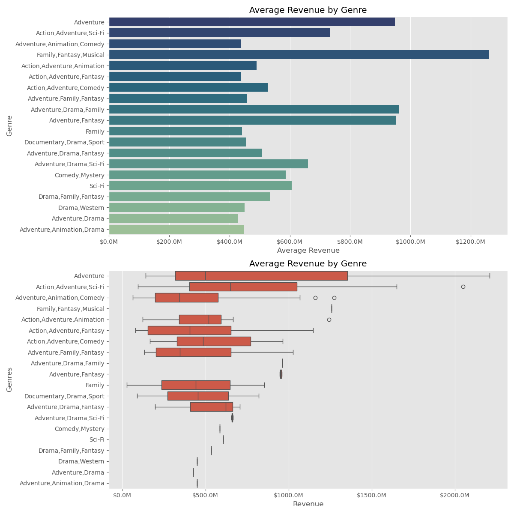

# Recommending Films for Box Office Success!


*Image by DOP Eben Bolter on the LED volume stage at Rebellion Film Studios in Oxford, UK.*

## Overview

Our company sees competitors creating original video content and now wants to join the market trend. We create a new film studio despite the lack of knowledge in everything related to movies.

As the data scientist of the company, my goal is to explore what types of films are currently performing the best at the box office and with my findings – create actionable insights that the company's new studio can use to decide what type of films to create.

Analysis by Kawsar Hussain

## Challenge

With the task at hand, we will be presenting to our company stakeholders three different recommendations that will directly affect our business revenue. The goal is to provide data-driven direction for our new film studio using evidence that our recommendations will result in truly benefitting the company.

## Datasets

In the folder `zippedData`, we have datasets from:

- [IMDB](https://www.imdb.com/)
- [The Numbers](https://www.the-numbers.com/)

## Solution

This project uses statistical analysis, including formulating three hypotheses of what contributes to a film's success. We infer three different business recommendations and use box-office data to prove our hypotheses and provide statistics as evidence to support our recommendations for the company and the direction for our new film studio.

## Results

### 1. Plan for higher budget production to maximize returns.

`Insight:` We observed that budget plays a significant role in a film's success, with higher budgets generally correlating with higher revenues. This was supported by the positive trend on the scatterplot and correlation coefficient close to +1.

`Recommendation:` Plan and allocate for higher budgets on our films to maximize potential revenue.


### 2. Releasing films during the spring months can create more sales.

`Insight:` We observed statistical significance of films released in the spring months and revenue earned compared to the other times of the year. This was supported by our p-value > 0.05 rejecting the null hypothesis that there's no difference of revenues in the spring months compared to other months.

`Recommendation:` Plan major releases during these months to capitalize on higher audience and box-office turnout.


### 3. Focus production towards profitable and compelling genres.

`Insight:` We observed a significant difference in the average revenues across various genres, giving us direction for production. This was supported by our p-value > 0.05 rejecting the null hypothesis that there's no difference in revenues across different genres, revealing genres with great value for production.

`Recommendation:` Produce films with aspects of the genre-groups that are proven to drive success.



## Conclusion

- #### Allocate for higher budgets on our films to maximize potential revenue.

- #### Plan major releases during these months to capitalize on higher audience and box-office turnout.

- #### Produce films with aspects of the genre-groups that are proven to drive success.

## Next Steps

- #### Implement predictive modeling and linear regression analysis to forecast movie revenues based on budget, genre, and release timing, providing stakeholders with data-driven revenue predictions.
- #### Explore other features and variables such as ratings and reviews to uncover additional factors that influence movie success, enhancing the overall predictive model.
- #### Apply optimization techniques for effective budget allocation, ensuring resources are used in a way that maximizes potential returns on investment.

## Repository Structure

```
├── images
│   ├── hypothesis1_graph.png
│   ├── hypothesis2_graph.png
│   ├── hypothesis3_graph.png
├── zippedData
│   ├── im.db.zip
│   ├── tn.movie_budgets.csv.gz
├── LICENSE
├── README.md
├── film_data_analysis.ipynb
└── film_data_analysis_presentation.pdf
```